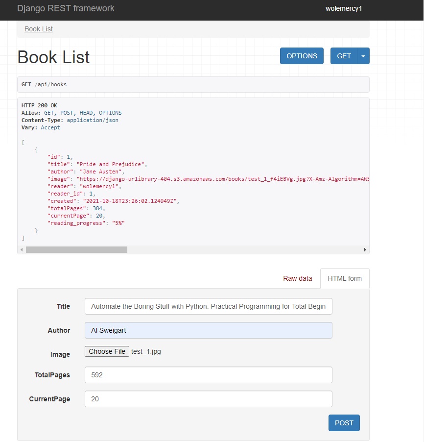
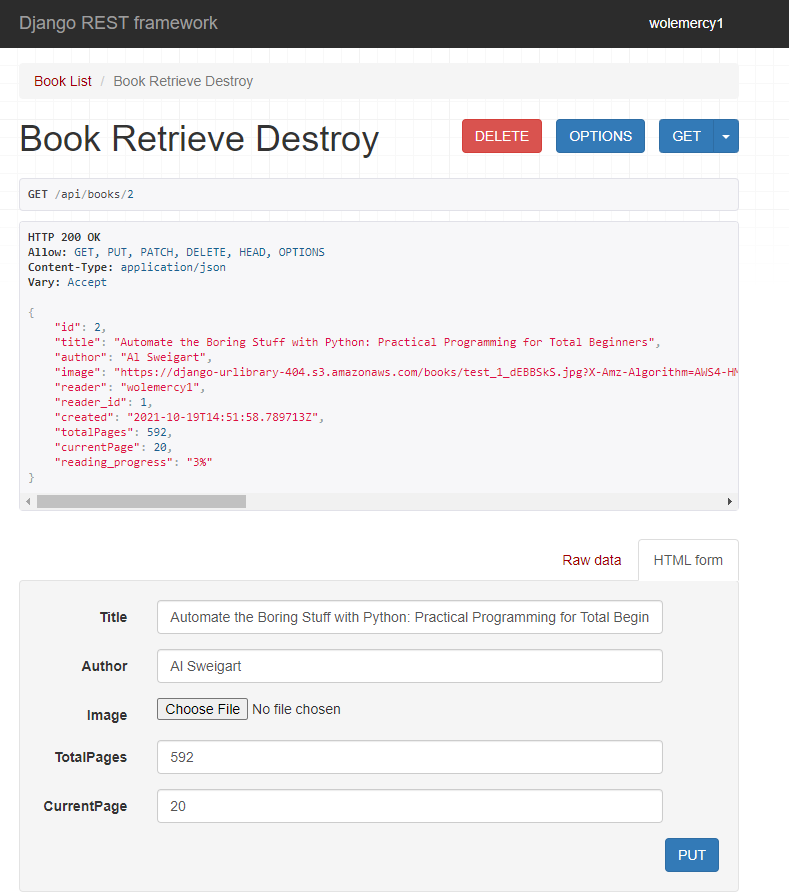
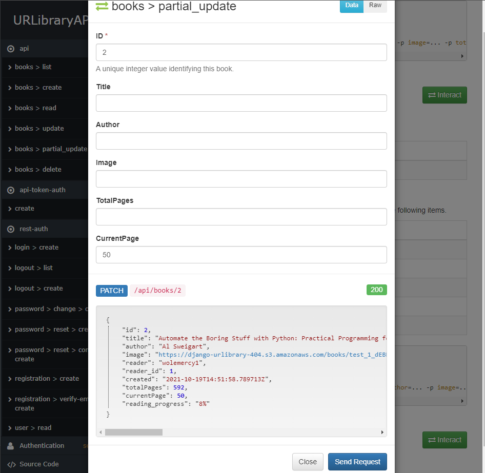

<!--
*** Thanks for checking out the Best-README-Template. If you have a suggestion
*** that would make this better, please fork the repo and create a pull request
*** or simply open an issue with the tag "enhancement".
*** Don't forget to give the project a star!
*** Thanks again! Now go create something AMAZING! :D
-->

<!-- PROJECT SHIELDS -->
<!--
*** I'm using markdown "reference style" links for readability.
*** Reference links are enclosed in brackets [ ] instead of parentheses ( ).
*** See the bottom of this document for the declaration of the reference variables
*** for contributors-url, forks-url, etc. This is an optional, concise syntax you may use.
*** https://www.markdownguide.org/basic-syntax/#reference-style-links
-->
[![Contributors][contributors-shield]][contributors-url]
[![Forks][forks-shield]][forks-url]
[![Stargazers][stars-shield]][stars-url]
[![Issues][issues-shield]][issues-url]
[![MIT License][license-shield]][license-url]
[![LinkedIn][linkedin-shield]][linkedin-url]

<!-- PROJECT LOGO -->
 

  <!-- -->

<h2 align="center">URLibrary-API</h2>

  

    A REST API that functions as a book library
     
    <a href="https://github.com/Wolemercy/urlibrary"><strong>Explore the docs »</strong></a>
     
     
    <a href="https://github.com/Wolemercy/urlibrary">View Demo</a>
    ·
    <a href="https://github.com/Wolemercy/urlibrary/issues">Report Bug</a>
    ·
    <a href="https://github.com/Wolemercy/urlibrary/issues">Request Feature</a>
  

<!-- TABLE OF CONTENTS -->

  
Table of Contents

  <ol>
    <li>
      <a href="#about-the-project">About The Project</a>
      <ul>
        <li><a href="#use-cases">Use Cases</a></li>
        <li><a href="#api-endpoints">API Endpoints</a></li>
      </ul>
    </li>
    <li><a href="#stack">Stack</a></li>
    <li><a href="#usage">Usage</a></li>
    <li><a href="#roadmap">Roadmap</a></li>
    <li><a href="#contributing">Contributing</a></li>
    <li><a href="#license">License</a></li>
    <li><a href="#contact">Contact</a></li>
    <li><a href="#acknowledgments">Acknowledgments</a></li>
  </ol>

<!-- ABOUT THE PROJECT -->
A REST API for keeping track of books you wish to read and have read as well as the progress you have made. It receives HTTP requests requiring fields such as the Book Title, Author, Current page, etc. and returns a list of books in the library as well as the current reading progress in the response. More information is available in the <a href="#api-documentation">API Documentation</a>.

<!--Here's a blank template to get started: To avoid retyping too much info. Do a search and replace with your text editor for the following: `Wolemercy`, `urlibrary`, `wolemercy`, `wolemercy`, `wolemercy`, `gmail.com`, `project_title`, `project_description` -->

### Use Cases
This API is particularly useful for anyone who wants to keep track of the books they have read so far as well as the progress they have made. It is also a great way for Book Clubs to have their members add books to their reading list and keep a tangible record of reading achievements.

(<a href="#top">back to top</a>)

## API Endpoints
* Registration - https://urlibrary.herokuapp.com/rest-auth/registration
* Login - https://urlibrary.herokuapp.com/rest-auth/login
* Library - https://urlibrary.herokuapp.com/api/books

## Stack

### Built With

* [Django](https://www.djangoproject.com/)
* [Django Rest Framework](https://www.django-rest-framework.org/)

### Media Files Storage
* [AWS Simple Storage Service - AWS S3](https://aws.amazon.com/)

### Database
* [PostgreSQL](https://www.postgresql.org/)

### Continuous Integration and Continuous Delivery (CI/CD)

* [GitHub Actions](https://github.com/features/actions)

### Deployment 
* [Heroku](https://heroku.com)

(<a href="#top">back to top</a>)

<!-- USAGE EXAMPLES -->
## Usage

The API supports:
* Book creation
* Book Image upload
* Book Updating
* Book Deletion

Here is what a sample POST Request looks like:

Here is what a sample response looks like when you request a book you created:

And here is what a patch request looks like using the interaction functionality from the docs:

For more examples, please refer to the [API Documentation](https://urlibrary.herokuapp.com/api/docs)

(<a href="#top">back to top</a>)

<!-- ROADMAP -->
## Roadmap
Some new features I'd like to add to this API are:
- Direct retrieval of Book details (e.g. author, book length, title) using the book's ISBN and [WorldCat's Api](https://www.oclc.org/developer/develop/web-services/worldcat-search-api.en.html) or [Google Books API](https://developers.google.com/books)
- Book classification by Genre

See the [open issues](https://github.com/Wolemercy/urlibrary/issues) for a full list of proposed features (and known issues).

(<a href="#top">back to top</a>)

<!-- CONTRIBUTING -->
## Contributing

Contributions are what make the open source community such an amazing place to learn, inspire, and create. Any contributions you make are **greatly appreciated**.

If you have a suggestion that would make this better, please fork the repo and create a pull request. You can also simply open an issue with the tag "enhancement".
Don't forget to give the project a star! Thanks again!

1. Fork the Project
2. Create your Feature Branch (`git checkout -b feature/AmazingFeature`)
3. Commit your Changes (`git commit -m 'Add some AmazingFeature'`)
4. Push to the Branch (`git push origin feature/AmazingFeature`)
5. Open a Pull Request

(<a href="#top">back to top</a>)

<!-- LICENSE -->
## License

Distributed under the MIT License. See `LICENSE.txt` for more information.

(<a href="#top">back to top</a>)

<!-- CONTACT -->
## Contact

Oluwole Ajewole - [@wolemercy](https://twitter.com/wolemercy) - wolemercy@gmail.com.com

Project Link: [https://github.com/Wolemercy/urlibrary](https://github.com/Wolemercy/urlibrary)

(<a href="#top">back to top</a>)

<!-- MARKDOWN LINKS & IMAGES -->
<!-- https://www.markdownguide.org/basic-syntax/#reference-style-links -->
[contributors-shield]: https://img.shields.io/github/contributors/Wolemercy/urlibrary.svg?style=for-the-badge
[contributors-url]: https://github.com/Wolemercy/urlibrary/graphs/contributors
[forks-shield]: https://img.shields.io/github/forks/Wolemercy/urlibrary.svg?style=for-the-badge
[forks-url]: https://github.com/Wolemercy/urlibrary/network/members
[stars-shield]: https://img.shields.io/github/stars/Wolemercy/urlibrary.svg?style=for-the-badge
[stars-url]: https://github.com/Wolemercy/urlibrary/stargazers
[issues-shield]: https://img.shields.io/github/issues/Wolemercy/urlibrary.svg?style=for-the-badge
[issues-url]: https://github.com/Wolemercy/urlibrary/issues
[license-shield]: https://img.shields.io/github/license/Wolemercy/urlibrary.svg?style=for-the-badge
[license-url]: https://github.com/Wolemercy/urlibrary/blob/master/LICENSE.txt
[linkedin-shield]: https://img.shields.io/badge/-LinkedIn-black.svg?style=for-the-badge&logo=linkedin&colorB=555
[linkedin-url]: https://linkedin.com/in/wolemercy
[product-screenshot]: images/screenshot.png

